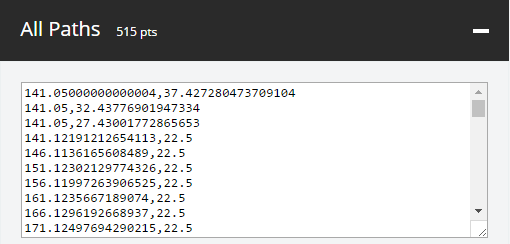

# PathToPoints

Convert SVG Paths to arrays of points - [Live Demo](https://shinao.github.io/PathToPoints/)

PathToPoints is a web application that allows you to extract points from SVG paths or generate them from text. It provides a visual representation of the points and offers various output formats.

### Features

- Drop SVG files or generate paths from text
- Adjust point generation settings
- Visual representation of extracted points
- Output points in various formats (individual paths, all paths combined, JSON)
- Automatic scaling and centering of paths
- Color-coded path visualization

### Usage

1. Drop an SVG file into the dropzone or use the "Generate from Text" option.
2. Adjust the "Step between points" setting if needed.
3. Choose the desired JSON output format (tuples or single array).
4. View the generated points in the expandable sections below.

### Output Formats

- Individual Paths: Each path's points are listed separately, color-coded for easy identification.
- All Paths Combined: A single list containing points from all paths, separated by '#'.
- JSON: An array of point arrays, either as tuples `[[x1, y1], [x2, y2], ...]` or a single array `[x1, y1, x2, y2, ...]`.

### Point Representation

- Each line represents a point.
- X and Y coordinates are separated by a comma.
- Paths are separated by '#' in the combined output.

### Notes

- The application only processes SVG path data. Other SVG attributes like rotations or transforms are ignored.
- While the visual representation might look unusual in some cases, the extracted point data should be accurate.

### Development

The main functionality is implemented in JavaScript, using libraries such as:

- jQuery for DOM manipulation
- Dropzone.js for file handling
- Raphael.js for SVG parsing and manipulation
- opentype.js for font handling in text-to-path conversion

To set up the project locally:

1. Clone the repository
2. Open `index.html` in a web browser
3. For development, you may need to run the page through a local server due to CORS restrictions when loading fonts

### Contributing

Contributions are welcome! Please feel free to submit a Pull Request.

### License

This project is open source. Please check the repository for license details.
